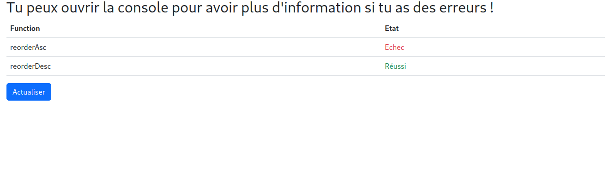

<div id="top"></div>

<!-- PROJECT LOGO -->
<br />
<div align="center">


<h3 align="center">Exercices JavaScript Débutant</h3>

   <p align="center">
      Voici quelques exercices pour apprendre les bases de la programmation avec JavaScript !
   </p>
</div>



### Développer Avec

* [JavaScript](https://developer.mozilla.org/fr/docs/Web/JavaScript)
* [Bootstrap 5](https://getbootstrap.com/docs/5.3/getting-started/introduction/)

<!-- GETTING STARTED -->

## Mise en Place

Voici la démarche à faire pour installer les exercices

### Installation

1. Cloner le Repo
   ```dotenv
   git clone https://github.com/Wyzzro/Cour_JavaScript_Debutant.git
   ```
2. Choisissez un exercice, ouvrer le fichier index.html dans votre navigateur.
3. Ouvrez ensuite le fichier main.js avec votre IDE, lisez les instructions puis coder le contenu des fonctions vides.
4. Enfin recharger la page web du navigateur, vous verrez alors si vous avez réussi l'exercice ou non.
